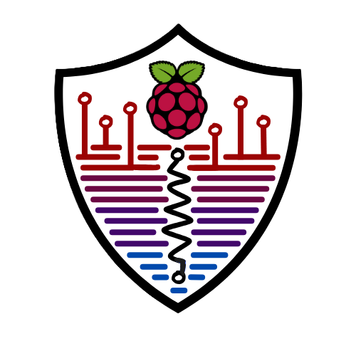

<!-- README HEADER -->

 

  <h1 align="center">Winter 2025 6A6/6P3 Final Project Repository</h3>

  

# ReActify 

## Team Members
- Alexander Burlec-Plaies
- Rania Mustafa
- Madison Cassley

## Important Notes
appsettings.json removed in order to protect keys, app will not give data without ReTerminal connections, this is simply a code showcase

## Project description
This project focuses on creating and delivering an application that will alert the user should there be an environmental hazard. It addresses issues ranging from floods, earthquakes and even fire detection. Looking at weather predictions can definitely provide useful information to ensure people take proper action for safety. However, with our application, this eases the need for constant searching, as our users have access to the current data the sensors send to our dedicated cloud platform, Azure. This permits the user to assess the environmental situation appropriately and act. 

Our subsystems overall play a role in sending and receiving data from our multitude of sensors. Our actuators will also take action based on the data from the sensors upon receiving a request  from our Azure IoT hub. Without the existence of our subsystems, users would be missing the opportunity of having a dedicated app to help have their backs and take care of their environmental safety. Users can rest assured knowing they have a system that is constantly checking for immediate danger and will take action to assist in case of danger. Mitigation plays a highly important role in taking care of the home environment and reducing risks of potential damages to user’s property and their wellbeing.

For more specific information regarding our hardware and a deep dive into each subsystem you can view their respective README:

[Fire and Air Quality](iot_subsystems/src/Alex_system/README.md)

[Earthquake Subsystem](iot_subsystems/src/earthquake_subsystem/README.md)

[Water and Floods Subsystem](iot_subsystems/src/water_floods_subsystem/README.md)

## Contributions

### Alexander
- Defining the functionality of the fire and air quality detection system
- Ensure telemetry is sent to the iot hub
- Provide IOT Hub for the team to use and include all required information to connect to the hub to the `appsettings.json` file.
- Wire up D2C and C2D communications for all subsystems
- Wire up Direct Method Invokation for all subsystem
- Creating and organizing classes as required
- UML Diagram Building
- README Contribution

### Rania
- Defining the functionality of earthquake detection system
- Authentication
- UI
- Device Twins
- UML Diagram Building
- README Contribution

### Madison
- Defining the functionality of the water floods detection system
- Authentication
- UI
- WireFrames
- Logo
- README Contribution

## App Overview

This app plays a role in automating actuators and receiving data from the Azure IoT hub. The user will be prompted to a login page where they can chose 
to login with an existing account or create a new account. This user will also be prompted to a section where they can access an individual subsystem sending telemetry
and manually control an actuator as required 

### Features
- Toggle/override an actuator as required
- Access to sub-system by category
- Authentication by Firebase
- Data sent and received by Microsoft Azure

## UML
[Link To UML](https://lucid.app/lucidchart/ebf337f0-b101-4ef4-a72b-225a703ed9f0/edit?view_items=27d9j5Q4GgoP%2C17d9QPmAp4DJ%2Cw7d9u0sV8bm7%2Cg7d90DU3QD5l%2Cq3d9.AU6SN5E%2CG8d9ZeRoFxZF%2CC8d93PvmZU95&invitationId=inv_b4c361dc-0ff6-4a43-9f4c-3bbc76e459bd)

## App Setup
1. Ensure proper connection string for the device and IoT hub is present on the `appsettings.json` on C# and on the user's .env file on their respective subsystem.
2. Ensure Firebase information is integrated to the application functionality.
3. Run the python subsystem with sudo permissions (As certain devices require elevated permissions)
  - To execute fire and air quality subsystem, user must run the following command in the iot_subsystem directory: `sudo PYTHONPATH=${PYTHONPATH}:src ~/Documents/repositories/final-project-refarminal/iot_subsystems/.venv/bin/python src/fire_air_quality_system`

4. Run the C# mobile code where the application will navigate to the login page.

## Future work
- Integrate receiving data from any weather service station.
- Integrate AI.
- Put additional devices that reflects the purpose of this application.

